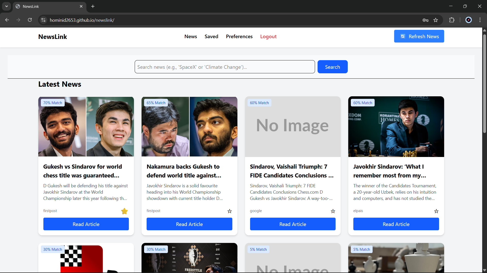

# NewsLink

A Single Page Application for personalised news discovery.  
Live: [https://hominid2653.github.io/newslink/](https://hominid2653.github.io/newslink/)

## Screenshots

| Mobile | Desktop |
|---|---|
|  |  |

## Overview

NewsLink is a browser-based news aggregator built as an academic assignment. It demonstrates core SPA principles: client-side routing, dynamic DOM rendering, state management via `localStorage`, and integration with a third-party REST API.

There is no backend server. All user data (accounts, preferences, saved articles) lives in the browser's `localStorage`. The news content is fetched live from the [NewsData.io](https://newsdata.io/) API.

---

## Table of Contents

- [What It Does](#what-it-does)
- [Key Features (Rubric Criteria)](#key-features-rubric-criteria)
  - [1. Search Functionality](#1-search-functionality)
  - [2. Data Display](#2-data-display)
  - [3. Form and Event Handling](#3-form-and-event-handling)
  - [4. DOM Manipulation](#4-dom-manipulation)
  - [5. Fetch API Usage](#5-fetch-api-usage)
  - [6. Code Structure](#6-code-structure)
  - [7. Styling and UX](#7-styling-and-ux)
- [Tech Stack](#tech-stack)
- [Project Structure](#project-structure)
- [Running Locally](#running-locally)
- [API](#api)
- [Data Stored in localStorage](#data-stored-in-localstorage)
- [Known Limitations](#known-limitations)


## What It Does

Users register, log in, set topic preferences, search for news, and save articles — all without page reloads. All user data persists in `localStorage`. News content is fetched live from the [NewsData.io API](https://newsdata.io/).

---

## Key Features (Rubric Criteria)

### 1. Search Functionality
- Search bar on the news page accepts any keyword query.
- Submitting calls `loadNews(true, query)`, which resets the feed and fetches fresh results filtered by the search term.
- Empty or whitespace queries fall back to the user's saved preferences.
- Edge cases handled: no results returns a user-facing message; network failures show an error prompt.

### 2. Data Display
- Each article renders as a card showing: headline, description, source name, image (with fallback placeholder), and a **Read Article** link.
- A **relevance score (% Match)** is computed per article based on keyword and category preference matches.
- Saved articles are displayed on a dedicated page with a remove button.

### 3. Form and Event Handling
- Login / Register form: validates non-empty fields, rejects duplicate usernames, handles legacy plain-text passwords gracefully.
- Search form: `onclick` handler prevents default page reload; `handleSearch()` drives the fetch.
- Preferences form: validates that at least one field (category or keyword) is set; rejects duplicates.
- Save/unsave buttons on each card toggle state immediately via event listeners attached at render time.

### 4. DOM Manipulation
- `showPage(pageId)` hides all `.page` sections and reveals the target — full SPA routing with no reloads.
- News cards are built and injected into the DOM dynamically inside `renderNews()`.
- Category tag picker is rendered dynamically in `renderCategoryPicker()` with active/inactive toggle states.
- Preference list (`renderPrefList()`) and news-page preference summary (`renderPreferences()`) both update reactively after every add or delete.
- Infinite scroll appends new cards automatically as the user reaches the bottom of the page.

### 5. Fetch API Usage
- `loadNews()` uses `fetch()` against the NewsData.io `/api/1/news` endpoint.
- Query parameters built dynamically: `q` from search or keyword preferences, `category` from category preferences, `page` for the pagination cursor.
- Response parsed with `.json()`; the `results` array is normalised to a consistent article shape before rendering.
- Missing fields handled: `image_url` falls back to a placeholder, missing `description` renders as an empty string.
- Errors caught in `try/catch`; a visible error message is shown on failure.

### 6. Code Structure
- Single JS module (`script.js`) organised into clear sections: Storage, Navigation, Auth, Preferences, Search, News, Scoring, Scroll.
- Functions are single-responsibility: fetching, rendering, and state updates are kept separate.
- Global functions explicitly exported via `window.*` for HTML `onclick` compatibility with ES module scope.
- `migratePreferences()` handles backward-compatible data shape changes without breaking existing accounts.

### 7. Styling and UX
- Styled with Tailwind CSS (CDN, no build step required).
- Responsive grid: 1 column on mobile → 4 columns on wide screens.
- Hover effects on nav links, cards, and buttons.
- Loading spinner shown during fetch; replaced by content or an error message on completion.
- Auth page is the only visible section before login; all other pages are protected.

---

## Tech Stack

| | |
|---|---|
| Markup | HTML5 |
| Styling | Tailwind CSS v4 (CDN) |
| Logic | Vanilla JS (ES Modules) |
| Persistence | `localStorage` |
| API | [NewsData.io](https://newsdata.io/documentation) |
| Hosting | GitHub Pages |

---

## Project Structure

```
newslink/
├── index.html   # App shell — all pages are <section> elements toggled by JS
└── script.js    # All logic: auth, routing, fetch, rendering, preferences
```

---

## Running Locally

```bash
git clone https://github.com/Hominid2653/newslink.git
cd newslink
python -m http.server 8080
# open http://localhost:8080
```

> Opening `index.html` directly as a `file://` URL may block ES module scripts in some browsers. Use a local server.

---

## API

Endpoint: `GET https://newsdata.io/api/1/news`

| Parameter | Source |
|---|---|
| `apikey` | Constant in `script.js` |
| `q` | Search input or user keyword preferences |
| `category` | User category preferences (comma-separated) |
| `page` | Cursor token from previous response (`nextPage`) |

Free tier limit: **200 requests/day**.

---

## Data Stored in localStorage

```
"users"       → { username: { password, preferences[], savedArticles[] } }
"currentUser" → username string
"currentPage" → last active page ID
```

---

## How Data Works

### Storage

All data lives in two `localStorage` keys:

**`"users"`** — JSON object keyed by username:
```json
{
  "alice": {
    "password": "c2VjcmV0",
    "preferences": [
      { "category": "technology", "keyword": "AI" },
      { "category": "sports",     "keyword": "" },
      { "category": "",           "keyword": "climate change" }
    ],
    "savedArticles": [
      {
        "title": "OpenAI releases GPT-5",
        "description": "A new model with...",
        "url": "https://example.com/article",
        "urlToImage": "https://example.com/img.jpg",
        "source": { "name": "TechCrunch" },
        "publishedAt": "2025-04-18 10:00:00"
      }
    ]
  }
}
```

**`"currentUser"`** — plain string: `"alice"`  
**`"currentPage"`** — plain string: `"newsPage"`

---

### Preferences Array

Each user holds an **array of objects** — one per preference pair:

```js
preferences = [
  { category: "technology", keyword: "AI" },   // both set
  { category: "sports",     keyword: "" },      // category only
  { category: "",           keyword: "Nairobi"} // keyword only
]
```

Adding pushes a new object; deleting splices by index. Duplicates are rejected by comparing every existing object before inserting.

---

### API Response → Normalisation

Raw response from NewsData.io:
```json
{
  "nextPage": "16745231",
  "results": [
    {
      "title": "Kenya wins gold",
      "link": "https://source.com/article",
      "image_url": "https://source.com/img.jpg",
      "source_id": "bbc",
      "pubDate": "2025-04-18 08:00:00"
    }
  ]
}
```

Immediately normalised to a consistent internal shape so saved and live articles are interchangeable:

```js
const normalized = articles.map(a => ({
  title:       a.title,
  description: a.description,
  url:         a.link,             // renamed
  urlToImage:  a.image_url,        // renamed
  source:      { name: a.source_id },
  publishedAt: a.pubDate           // renamed
}));
```

---

### Relevance Scoring Algorithm

Every article is scored against all preferences, then the array is sorted descending before render:

| Signal | Points |
|---|---|
| Preference keyword found in title | +60 |
| Preference keyword found in description | +30 |
| Preference category found in title or description | +20 |
| Word overlap with last 10 saved article titles | +5 per match |
| Floor (no matches) | 5 |
| Ceiling | 100 |

**Example** — preferences: `{ keyword: "AI" }` and `{ keyword: "Nairobi" }`:

| Article title | Matches | Score |
|---|---|---|
| "AI startup opens office in Nairobi" | "AI" in title (+60), "Nairobi" in title (+60) | **100** |
| "Local football results" | none | **5** |

---

### Pagination

NewsData.io uses cursor tokens, not page numbers. Each response includes `"nextPage": "16745231"`. The app stores this in `nextPageToken` and appends `&page=16745231` on the next fetch. When `nextPage` is absent, `hasMore` is set to `false` and infinite scroll stops.

## Known Limitations

- Passwords use `btoa()` (base64 only, not secure — for demo only).
- No session restore on page refresh — user is redirected to login.
- API key is a hard-coded constant; needs upgrading account or hosting on a proxy in order to store in a .env file.
- Free API tier caps at 200 requests/day.
